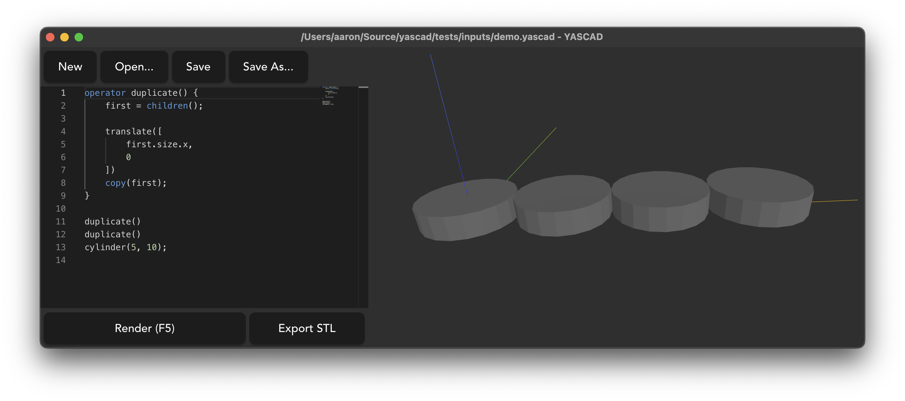

# YASCAD - Yet Another SCAD

> This project is **very heavily work-in-progress!**

YASCAD is a 3D modelling language heavily inspired by [OpenSCAD](https://openscad.org/).

YASCAD's primary concept over OpenSCAD is that **geometry is first-class**. You can inspect the 
properties of geometry you've already drawn, which leds you draw or manipulate other geometry
relative to the rest of your model.

## Goals

- Create advanced models without needing to break out variables extensively.
- Focus primarily on creating productive, 3D-printable models.
- Be very familiar to users who are already proficient with OpenSCAD.

## Non-Goals

- 100% compatibility with OpenSCAD. Design decisions which make sense for YASCAD take precedence
  over maintaining compatibility or familiarity with OpenSCAD.
- Being a general-purpose programming language. This is for models only.
- Constraint solving between geometry. Execution should remain procedural/functional, otherwise
  this becomes too confusing.

## Usage

This needs a recent nightly Rust. No crates are currently available, so check out the repo (recursively - submodules are used).

You also need CMake to compile some of the non-Rust dependencies.

There are two executable entry points:

- `bin/yascad`, a CLI for building models
- `gui`, a Tauri-based graphical editor

In addition to these, the libraries are:

- `lang`, language front-end/back-end crates
- `manifold-rs`, Rust bindings around the [Manifold](https://github.com/elalish/manifold) geometry library
